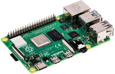

# Raspberry Pi Docker-server



## intro

> This document is my personal log of making a home server with a raspberry pi 4 (4GB model).
> If you like to know more about docker, what it is and how it works i recommend to watch this video: [Andreas Spiess: #295 Raspberry Pi Server based on Docker, with VPN, Dropbox backup, Influx, Grafana, etc.](https://www.youtube.com/watch?v=a6mjt8tWUws). It explaines in a simple way what docker is, how it works and how you can use it. It is only 18 minutes and i think it is one of best video's that explaines in a short way what docker is, how it works and how you can use it.

## Why making a server with docker, a raspberry pi and ubuntu?

> I believe docker is a usefull skill and tool in any development environment. I document my steps to learn how to work with docker, docker-compose and ubuntu.

## installation

### Install ubuntu

1. [Download](https://ubuntu.com/download/raspberry-pi) the newest ubuntu raspberry pi image. (Use an image that is newer than ubuntu 19.10. _Older versions don't support 4GB raspberry pi model_)

2. Write an image to an sd-card. I use the disks application in ubuntu to write an image to an sd-card. When i open up the disks application an select the sd-card on the left pane. On the left of the minimize button you wille a 3 dotted button, select this to see the drive options menu. In the drive option menu select the "restore disk image option." Select the image you downloaded from step 1 to flash the sd card. If you would like to know more about flashing an sd card with an operatingsystem you can look at the [OMV installationguide](https://github.com/OpenMediaVault-Plugin-Developers/docs/blob/master/Adden-B-Installing_OMV5_on_an%20R-PI.pdf). They have an extensive document about installing omv and the first chapter they explain a lot about how to test the integrity of you sd-card with and how to make sure the disk is going to work properly on your system. If you don't like reading you can do a quick setup with this video from [ETA-prime](https://www.youtube.com/watch?v=HMo9C7LCzE0)

3. Before you put you sd-card in your raspberry pi to boot ubuntu you first have to edit some configuration files. Go to disks application and mount the "boot" partition. create an empty file without any extension and name it "SSH". This will enable ssh on boot, so you are able to use ssh. I will use a ethernet cable to attach my raspberry pi to my home network. In this partition you will find a readme with information about config.txt. A raspberry pi doesn't come with a nice graphical interface. You need to edit config.txt to make changes in the hardware interface of the device. Use the following lines to give the device an overclock!(Make sure to provide enough cooling to your pi otherwise you might break it.)

```bash
over_voltage=4
arm_freq=2000
gpu_freq=650
```

4. Insert your sd-card and boot from it. Find the ip of your raspberry pi. You can find it in your router admin page or use an app like fing on your mobile phone(Your raspberry pi and phone need to be in the same network) You can acces your server now with ssh through an terminal.

```bash
ssh ubuntu@192.1.1.11
```

### Install docker and composer.

Steps

1. Install Docker

```bash
curl -sSL https://get.docker.com | sh
```

2. Add permission to Pi User to run Docker Commands

```bash
sudo usermod -aG docker pi
```

Reboot here or run the next commands with a sudo

3. Test Docker installation

```bash
docker run hello-world
```

4. IMPORTANT! Install proper dependencies

```bash
sudo apt-get install -y libffi-dev libssl-dev

sudo apt-get install -y python3 python3-pip

sudo apt-get remove python-configparser
```

5. Install Docker Compose

```bash
sudo pip3 install docker-compose
```

## Docker compose.

> There are several way's of setting up containers with docker. Docker compose is one way of setting up containers.

### todo

## Sources

I used the following sources to setup my raspberry pi server.

### Video tutorials

[Andreas Spiess: #295 Raspberry Pi Server based on Docker, with VPN, Dropbox backup, Influx, Grafana, etc.](https://www.youtube.com/watch?v=a6mjt8tWUws)
[ETA PRIME: Install Ubuntu 19.10 On The Raspberry Pi 4 Full Ubuntu Desktop](https://www.youtube.com/watch?v=HMo9C7LCzE0&t=35s)

[Install Docker and Docker Compose on Raspberry pi 4(Raspbian Buster)](https://medium.com/@techiebouncer/install-docker-and-docker-compose-on-raspberry-pi-4-raspbian-buster-c5b78b9a0d08)

### articles

[Ultimate Smart Home Media Server with Docker and Ubuntu 18.04 – Basic](https://www.smarthomebeginner.com/docker-home-media-server-2018-basic/#What_is_a_Home_Media_Server)
[Traefik Tutorial: Traefik Reverse Proxy with LetsEncrypt for Docker Media Server](https://www.smarthomebeginner.com/traefik-reverse-proxy-tutorial-for-docker/)
